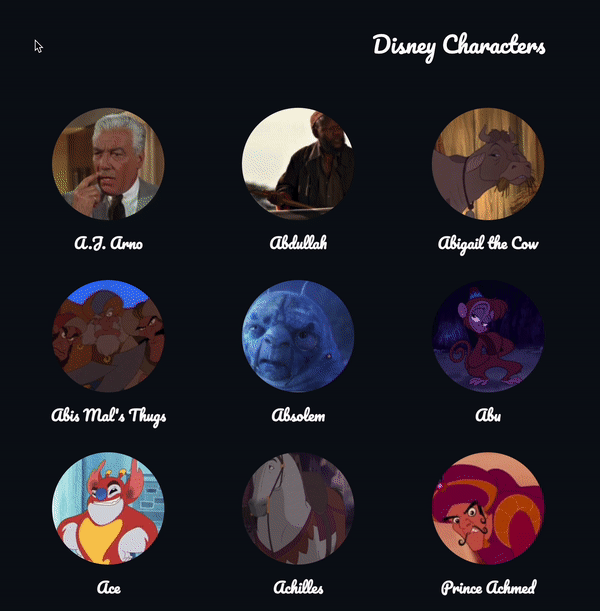
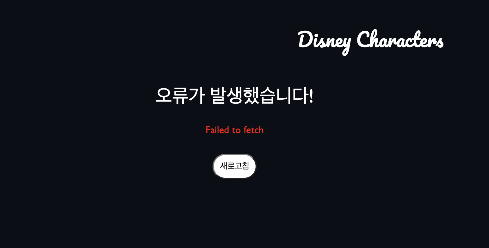

<p>


</p>

<br/>

## 🐹 프로젝트 내용

디즈니 캐릭터 리스트

## 🚀 배포

[배포 사이트](https://disney-omega.vercel.app/)<br/>

## 🗓️ 프로젝트 기간

제작 : 2023.6.4 ~ 2023.6.13

### 💡 프로젝트 상세 구현 내용

- `suspense` 와 `error-boundary` 을 사용하여 선언적 방식으로 fallback을 구현

### ✍️ 코드리뷰 반영 사항

코드리뷰 반영사항 [Pull Request](https://github.com/j2h30728/disney/pull/4)

1. querykey 를 사용한 react-query 의 default Fetching Fn 의 fetch url 설정
2. error boundary 설정

### 👀 프로젝트 상세 프리뷰


<br/>

#### 에러페이지 (error boundary)



## 📌 프로젝트 실행 방법

1. Clone the repo

```javascript
$ git clone https://github.com/j2h30728/disney.git
```

2. Install NPM packages

```javascript
$ npm install
```

3. Getting Started

```javascript
$ npm run dev
```

<br/>
